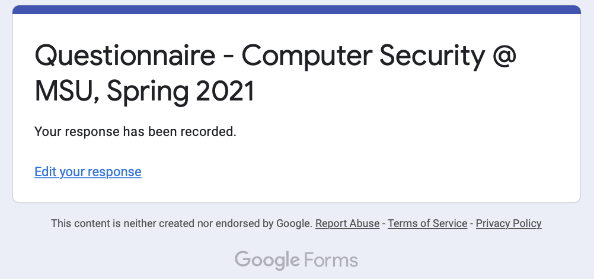

# Lab 00: Getting Started

- **Name (NetID):** Travis Peters (w52k448)  
- **Class:** CSCI 476/594
- **Email:** travis.peters1@montana.edu
- **Due:** 01/19/2021

**Link to assignment:** [https://www.traviswpeters.com/cs476-2021-spring/labs/lab00.html](https://www.traviswpeters.com/cs476-2021-spring/labs/lab00.html)

> **NOTE:** I like this [Markdown cheatsheet](https://devhints.io/markdown). There are loads of other great resources on the Internet too!

## Task 1: Confirming My Questionnaire Response

_...summary of the purpose of the task/question..._  

_...solution / code snippets / screenshots / other evidence..._  

_...observations / conclusions..._  

Here is an example of including an image in my submission:



I'm using Markdown's simply syntax to include an image that is stored in the same folder as this `README.md`.
You can also use the HTML `img` tag if you need to be a bit more expressive in how your image is included.

## Task 2: A Demo of Tasks with SubTasks

### Task 2(a): A Meaningful SubTask Title

_...summary of the purpose of the task/question..._  

_...solution / code snippets / screenshots / other evidence..._  

_...observations / conclusions..._  

### Task 2(b): A Meaningful SubTask Title

_...summary of the purpose of the task/question..._  

_...solution / code snippets / screenshots / other evidence..._  

_...observations / conclusions..._  

Here is an example of my including some code in my submission:

```c
// Compile:
//  $ gcc myprog.c -o myprog

#include <stdio.h>

int main()
{
    printf("Hello World!\n");
}
```

## Task 3: My Lessons Learned

1. I love to learn. _(I realized this as a young age!)_
2. I learn to love. _(I'm not really sure what I mean by this...)_
3. I _what_ to _WHAT?_ _(I'm really running out of ideas here...)_
